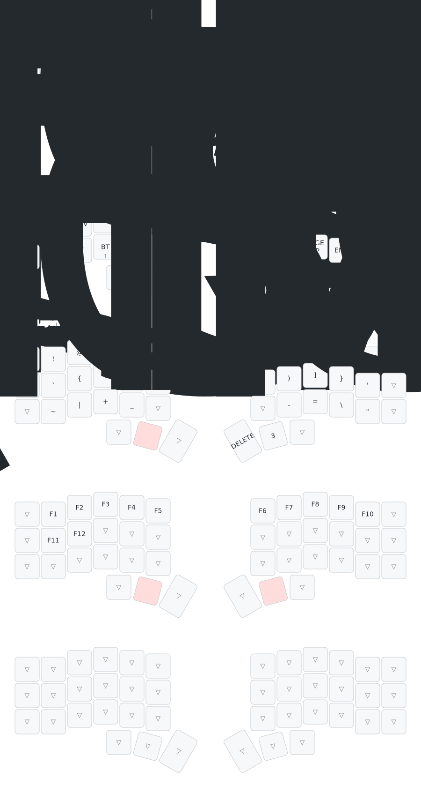

# ZMK Config for Corne V3 Keyboard

This is my personal [ZMK](https://zmk.dev/) configuration for the [Corne](https://github.com/foostan/crkbd) (CRKBD) V3 keyboard.

## Hardware

- **Keyboard:** Corne V3 (split 3x6 + 3 thumb keys)
- **Controller:** nice!nano v2

## Keymap

The keymap visualization below is automatically generated using [keymap-drawer](https://github.com/caksoylar/keymap-drawer).

## Layers

### Default Layer
The base QWERTY layer featuring:
- **Home-row mods:** GUI, Alt, Ctrl, and Shift on the home row (ASDF on left, JKL and semicolon on right)
- **Thumb keys:** Escape, Tab (hold for Raise), Space, Backspace, Enter (hold for Lower), Context Menu

### Lower Layer (Navigation & Media)
Accessed by holding Enter:
- **Top row:** Number keys 1-0
- **Home row:** Media controls (Vol Down, Previous, Play/Pause, Next, Vol Up) on the left, Arrow keys on the right
- **Bottom row:** Bluetooth controls on the left, Page navigation (Home, Page Down, Page Up, End, Insert) on the right

### Raise Layer (Symbols)
Accessed by holding Tab:
- **Top row:** Symbols (! @ # $ % ^ & * ( ))
- **Home row:** Brackets and parentheses (backtick, braces, brackets, parentheses on left; closing parentheses, brackets, braces, and apostrophe on right)
- **Bottom row:** Additional symbols (~ | + _ on left, - = \ " on right)

### Function Layer (Layer 3)
Accessed by holding both Tab and Enter:
- Function keys F1-F12

## Features

- **Home-row modifiers:** Balanced hold-tap behavior with `require-prior-idle-ms` to prevent accidental modifier activation
- **Bluetooth support:** Quick profile switching and clear functions
- **Media keys:** Volume control and playback navigation
- **No outer columns:** The outer columns are disabled (`&none`) for a cleaner 3x5+3 layout feel

## Building

The firmware is automatically built using GitHub Actions when changes are pushed to the repository. You can download the latest firmware from the [Actions](../../actions) tab.

To build manually, refer to the [ZMK documentation](https://zmk.dev/docs/user-setup).

## Keymap Visualization

The keymap SVG is automatically updated by the [keymap-drawer](https://github.com/caksoylar/keymap-drawer) workflow whenever changes are made to the keymap files.
