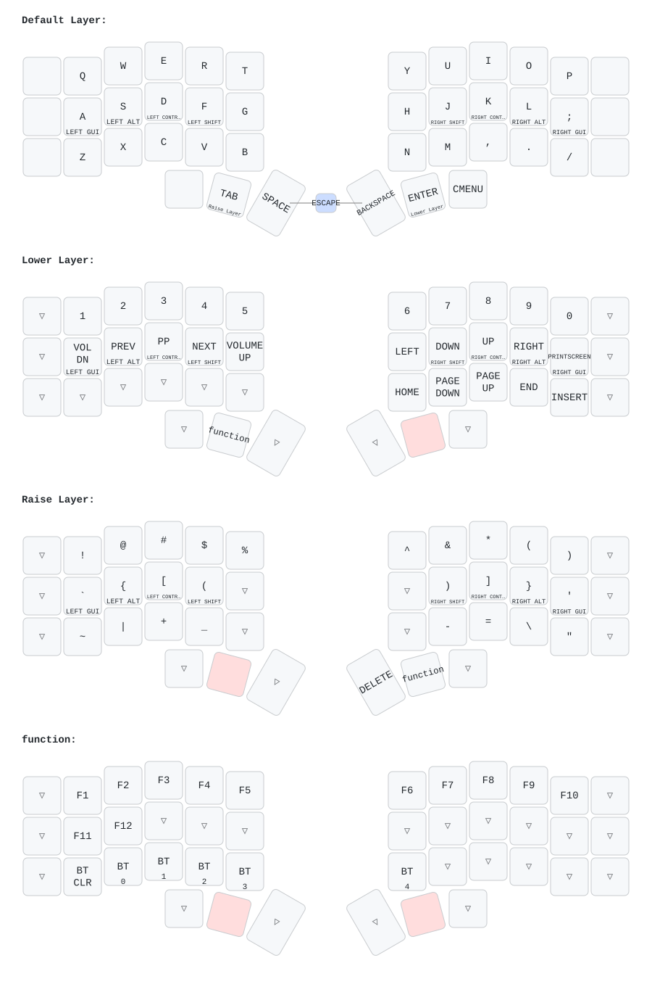

# ZMK Config for Corne V3 Keyboard

This is my personal [ZMK](https://zmk.dev/) configuration for the [Corne](https://github.com/foostan/crkbd) (CRKBD) V3 keyboard.

## Hardware

- **Keyboard:** Corne V3 (split 3x6 + 3 thumb keys)
- **Controller:** SuperMini nRF52840

## Keymap

The keymap visualization below is automatically generated using [keymap-drawer](https://github.com/caksoylar/keymap-drawer).

## Building

The firmware is automatically built using GitHub Actions when changes are pushed to the repository. You can download the latest firmware from the [Actions](../../actions) tab.

To build manually, refer to the [ZMK documentation](https://zmk.dev/docs/user-setup).

## Keymap Visualization

The keymap SVG is automatically updated by the [keymap-drawer](https://github.com/caksoylar/keymap-drawer) workflow whenever changes are made to the keymap files.
